# Diadem Pixhawk Release
## ROS2 Humble Release


<div align="center">

Welcome to the official public repository for **Diadem** by **RigBetel Labs**.

**Purpose:**  
This repository hosts essential documentation and code for *Diadem Robot*, facilitating transparency and collaboration.

**Privacy:**  
Certain sensitive packages and scripts have been excluded to maintain privacy standards.

**Contents:**  
- **Documentation:** Detailed guides and technical specifications.
- **Codebase:** Essential source code for *Diadem Robot*.
- **Resources:** Supplementary materials and dependencies.


**Contact:**  
For inquiries and collaboration opportunities, reach out to RigBetel Labs.


<a href="https://rigbetellabs.com/"></a>
<a href="https://www.youtube.com/channel/UCfIX89y8OvDIbEFZAAciHEA"></a>
<a href="https://www.instagram.com/rigbetellabs/"></a>


</div>

--- 

## Table of Contents

- [**1. Package Description**](#1-package-description)
   - [**1.1 diadem_description**](#11-diadem_description)
   - [**1.2 diadem_firmware**](#12-diadem_firmware)
   - [**1.3 diadem_gazebo**](#13-diadem_gazebo)
- [**2. Simulation**](#2-simulation)
- [**3. Real Robot Instructions**](#3-real-robot-instructions)
  - [**3.1 Initial Wifi Setup**](#31-initial-wifi-setup)
  - [**3.2 Launch Sequence**](#32-launch-sequence)
  - [**3.3 RC Control Mode**](#33-rc-control-mode)
      - [**Motor Control Modes**](#motor-control-modes)
      - [**Robot Control Modes**](#robot-control-modes)
      - [**Custom PID Mode ⚠️**](#custom-pid-mode-%EF%B8%8F)
  - [**3.4 ROS-based Teleoperation Mode**](#34-ros-based-teleoperation-mode)
  - [**3.5 ROS-based Pixhawk Control Mode**](#35-ros-based-pixhawk-control-mode)
  - [**3.6 USB Port Configuration**](#36-usb-port-configuration)
  - [**3.7 Get IP Address of Robot**](#37-get-ip-address-of-robot)
- [**5. Features via ROS Topics**](#5-features-via-ros-topics)
- [**6. Diadem Robot Parameters**](#6-diadem-robot-parameters)
- [**7. Diagnostic Tests**](#7-diagnostic-tests)
   - [**Overview**](#overview)
   - [**Instructions**](#instructions)
   - [**Detailed Instructions**](#detailed-instructions)
   - [**How to Run Diagnostics**](#how-to-run-diagnostics)
   - [**Important Notes**](#important-notes)
- [**8. Charging Instructions**](#8-charging-instructions)
- [**9. Removing the top lid of the robot**](#9-removing-the-top-lid-of-the-robot)
- [**10. LED Indicators Instructions**](#10-led-indicators-instructions)

## 1. Package Description

### 1.1 diadem_description

Holds the robot description including URDF, STL, config files for RVIZ, and Gazebo.

| File               | Description                                 | Nodes Launched                    |
|--------------------|---------------------------------------------|-----------------------------------|
| [display.launch.py](https://github.com/rigbetellabs/diadem/blob/humble-pixhawk-release/diadem_description/launch/display.launch.py)         | Launches Gazebo simulation with all necessary plugins and state publishers, along with RViz.                                                                                                                                     | robot_state_publisher, joint_state_publisher, rviz2, gazebo_ros                     |
|[rviz.launch.py](https://github.com/rigbetellabs/diadem/blob/humble-pixhawk-release/diadem_description/launch/rviz.launch.py)           | Launches RViz2 with necessary configuration.                                                                                                                                                                                      | rviz2 with configured settings                                                         |
| [state_publisher.launch.py](https://github.com/rigbetellabs/diadem/blob/humble-pixhawk-release/diadem_description/launch/state_publisher.launch.py) | Launches state publishers for the robot, including robot_state_publisher and joint_state_publisher nodes.                                                                                                                                                                                         | robot_state_publisher, joint_state_publisher                                            |


### 1.2 diadem_firmware

Provides sensor and actuation topics.

| File                | Description                                             | Nodes Launched                |
|---------------------|---------------------------------------------------------|-------------------------------|
| [bringup.launch.py](https://github.com/rigbetellabs/diadem/blob/humble-pixhawk-release/diadem_firmware/launch/bringup.launch.py) | Launches the joy node and auto joy node for complete joystick and waypoint-based control of the robot using a joystick.                                                                                  | joy_node, auto_joy_teleop                   |
| [hubble_scripts.launch.py](https://github.com/rigbetellabs/diadem/blob/humble-pixhawk-release/diadem_firmware/launch/hubble_scripts.launch.py)  | Provides feedback to the controller about network data and navigation data, including network_pub node and goal_status_publisher node.                                                              | network_publisher (freezed binaries), goal_status_publisher (freezed binaries) | |
| [mavros_launch.py](https://github.com/rigbetellabs/diadem/blob/humble-pixhawk-release/diadem_firmware/launch/mavros_launch.py)   | Launches Mavros Node                                                                                                                                      | Mavros                 |
| [micro_ros.launch.py](https://github.com/rigbetellabs/diadem/blob/humble-pixhawk-release/diadem_firmware/launch/micro_ros.launch.py)   | Launches MicroROS                                                                                                                                      | Micro ROS                 |
### 1.3 diadem_gazebo
Simulation environment for tortoisebotpromax in Gazebo.

| File                | Description                                             | Nodes Launched                |
|---------------------|---------------------------------------------------------|-------------------------------|
|  [gazebo.launch.py](https://github.com/rigbetellabs/diadem/blob/humble-pixhawk-release/diadem_gazebo/launch/gazebo.launch.py)      | Launches a Gazebo environment with a specified world, along with the gazebo_ros node.                                    | gazebo_ros node                                         |
|  [spawn_robot.launch.py](https://github.com/rigbetellabs/diadem/blob/humble-pixhawk-release/diadem_gazebo/launch/spawn_robot.launch.py) | Launches a Gazebo environment with a specified world and spawns the robot with necessary plugins using gazebo_ros node. | gazebo_ros node, robot_state_publisher, joint_state_publisher, gazebo_controllers |


## 2. Simulation
For simulation, below process needs to be done in laptop/PC with ROS2 humble installed in it.

Clone the diadem repository into your workspace:
```bash
cd ~/ros2_ws/src  # Assuming ros2_ws is the name of the workspace
git clone -b humble-pixhawk-release https://github.com/rigbetellabs/diadem.git
```

Install dependent packages:

```bash
cd ~/ros2_ws/src/diadem
cat requirements.txt | xargs sudo apt-get install -y 
```

Build the workspace:

```bash
cd ~/ros2_ws
colcon build
```  

To Launch simulation:
```bash
ros2 launch diadem_gazebo spawn_robot.launch.py 
```
The gazebo world looks like this:

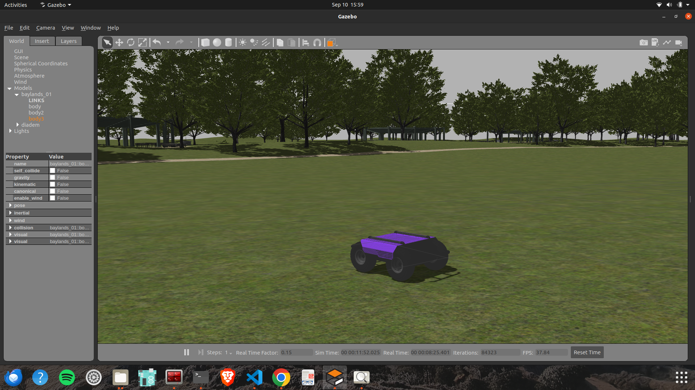

Now you can teleop the robot by publishing the msgs on /cmd_vel topic
## 3. Real Robot Instruction

> [!IMPORTANT]
>**Warning:** When the robot is first powered on, it starts in demo mode and can be manually controlled using the RC. However, without a WiFi connection, critical features like mission planning, SSH, RViz visualization, and development mode are unavailable. To unlock full functionality, including remote access, the initial WiFi setup must be completed.

### 3.1 Initial Wifi Setup

Follow the steps below to connect the robot to your desired Wifi network
#### 1. Create a mobile hotspot
Initiate a hotspot from your smartphone/laptop with the credentials
- Hotspot Name:  `admin`
- Hotspot Password: `adminadmin`

<p align="center">
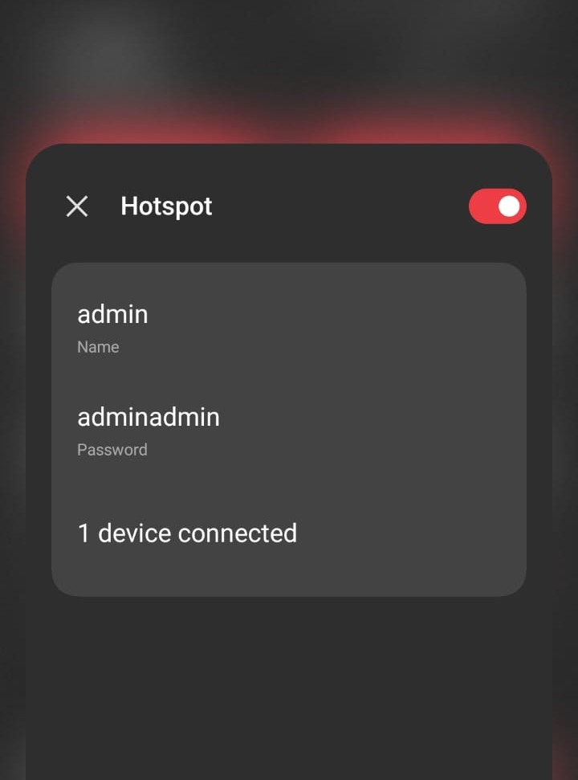
</p>

#### 2. Start the robot
Power on the robot and wait until it connects to your hotspot network

| On powering on:            | When connected to hotspot:                               | 
|--------------------|---------------------------------------------|
|    |    |

#### 3. SSH into the robot

- Connect your laptop/remote device to the same hotspot
<p align="center">

</p>

- Open a new terminal, and enter the SSH credentials
```bash
# Method 1-ssh using user name 
ssh diadem@192.168.51.102  
pwd: "rbl@2020"

#Method 2 -ssh using ip address 
ssh diadem@rigbetellabs.local  
pwd: "rbl@2020"
```
> [!TIP]
> IP can be seen on the display of robot once connected with WiFi


| Method1           | Method2                            | 
|--------------------|---------------------------------------------|
| 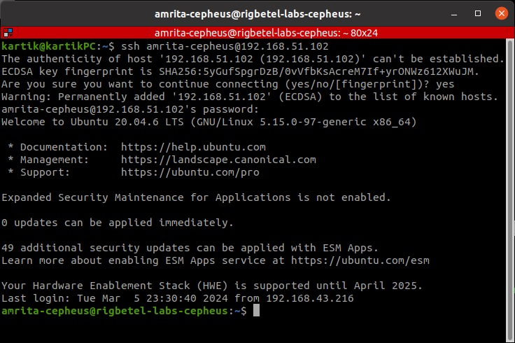   | 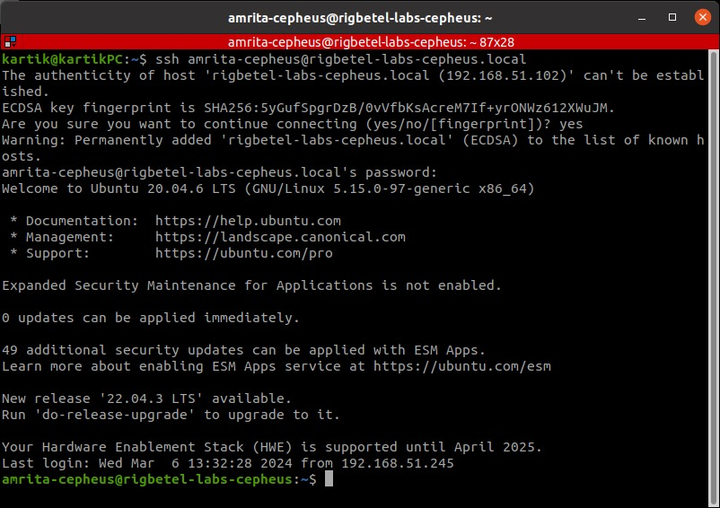    |

#### 4. Connect to Wifi

- Enter the following command on the ssh terminal to check available networks
```bash
sudo nmcli dev wifi list --rescan yes
```
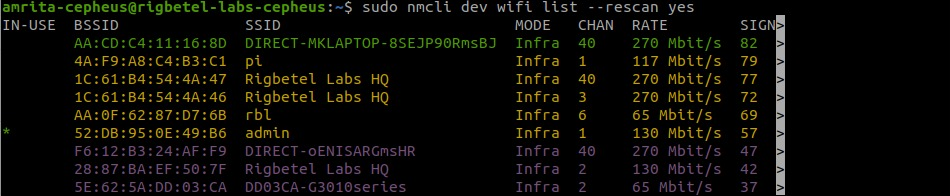 

- Connect to your wifi network
```bash
sudo nmcli device wifi connect "your-wifi-name" password "your-wifi-password"
```
 

> [!IMPORTANT]
> This will close the ssh pipeline and no response will be recieved over it further. Wait for about 30 seconds for robot to be connected to your wifi, once connected it will show the wifi name along with the IP address on the robot display.

#### 4. SSH using your Wifi
- Now the robot is connected to your Wifi network! You can now shutdown your mobile hotspot, connect your remove device to the same wifi and access the robot using SSH:

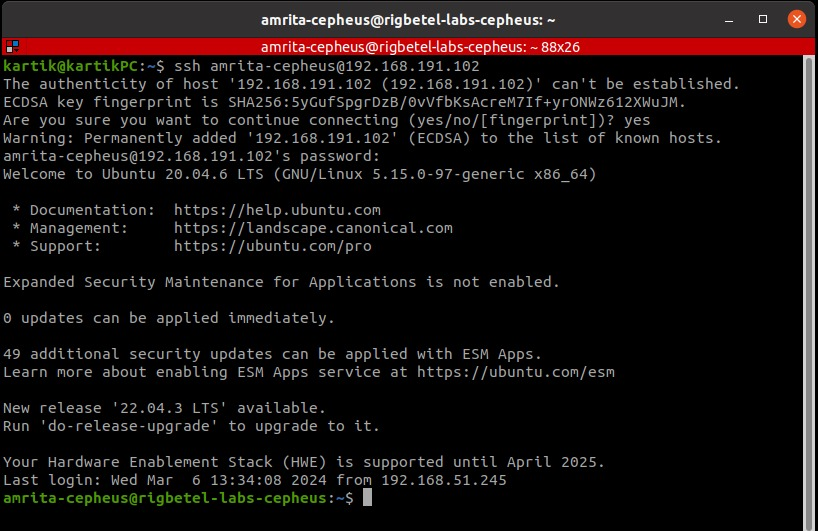 


### 3.2 Launch Sequence
#### Switching mode in robot

### Modes of robot.
There are two modes of robot 
#### 1. Demo Mode -  ROS2 nodes are automatically launched during the robot's startup/boot process.
>[!NOTE]
By default, the robot is configured to start automatically in Demo Mode, running ROS without requiring a Wi-Fi network. To start the robot in Demo Mode (i.e., to automatically launch the desired ROS processes on boot), use the following command:
```bash
# For going into demo mode
cd ros2_ws/src/diadem
./demo.sh
```

#### 2. Development Mode - No ROS2 nodes are launched during startup.
> [!NOTE]
To switch to Development Mode, which will prevent any ROS processes from starting automatically, allowing you to test your launch files, SSH into the robot and execute the necessary commands to disable automatic startup.
```bash
# For going into Development mode
cd ros2_ws/src/diadem
./development.sh
```

To launch only sensors and actuators without navigation and odometry:
```bash
ros2 launch diadem_firmware bringup.launch.py
```
By default realsense launch is set to False, launch the script with realsense:=True Argument to get the realsense up. 
### 3.3 RC Control Mode

RC Control is operated by default on bootup. Turn on the Radiolink controller and set its mode to RC mode to start controlling the robot using RC.

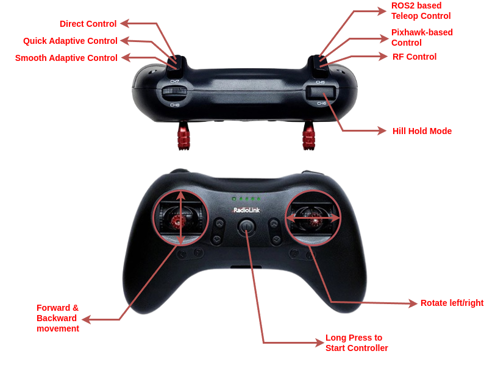

### Motor Control Modes

| Criteria                | Direct Control | Quick Adaptive Control | Smooth Adaptive Control |
|-------------------------|----------------|------------------------|-------------------------|
| RC and CMD Control      | &#9745;        | &#9745;                | &#9745;                 |
| Fast Reaction Time      | Fastest        | Moderate               | Slowest                 |
| Closed Loop System      | False          | True                   | True                    |
| Inertial Jerks          | Too Jerky      | Moderate Jerk          | Least Jerky             |

### Robot Control Modes

| Control Method           | Description                                                                                           | WiFi Requirement | Compatibility with PID Modes               |
|--------------------------|-------------------------------------------------------------------------------------------------------|------------------|-------------------------------------------|
| RF Control               | Works directly with Radiolink RC controller without the need for any WiFi network.                   | Not Required     | Direct Control <br> Quick Adaptive Control <br> Smooth Adaptive Control |
| ROS-based Teleop Control | Subscribes to `cmd_vel` topic to actuate the vehicle. Requires WiFi network to work.                  | Required         | Direct Control <br> Quick Adaptive Control <br> Smooth Adaptive Control |
| Pixhawk-based Control    | Uses Pixhawk to gain missions and converts the data to `cmd_vel`, which is accessible to ROS.         | Required         | Direct Control <br> Quick Adaptive Control |

### Custom PID Mode ⚠️ 

> [!WARNUNG]🚫This mode is not recommended as the PID values are tuned by us. If you choose to use custom values, ensure that the robot is kept above ground.🚫 

To add custom PID values and save them, use the following commands:

1. **Add Custom PID Values**:
    ```bash
    ros2 topic pub -1 /pid/constants std_msgs/msg/Float32MultiArray "{data: [1.1, 2.2, 3.3]}"
    ```

2. **Save the Custom PID Values**:
    ```bash
    ros2 topic pub -1 /pid/custom/save std_msgs/msg/Float32MultiArray "{data: [1.1, 2.2, 3.3]}"
    ```

The custom PID setup button is disabled by default and can only be accessed upon enabling it purposefully.

```bash
ros2 topic pub -1 /pid/custom/enable std_msgs/Bool "data: true"
```

When enabled, you can press the button shown above to switch to your custom PID mode with your custom PID values.


### 3.4 ROS-based Teleoperation Mode

ROS communication works on the WiFi Network. Make sure to arrange the WiFi network before starting the robot. Once connected to the network, SSH into the PC and launch:

```bash
ros2 launch diadem_firmware bringup.launch
```

> **IMPORTANT**: This launch file is initiated by default on bootup of the robot. If the startup service is kept activated, you do not need to manually launch the files.

Now you can access the topics on the robot. Teleoperate the robot using `teleop_twist_keyboard`:

```bash
ros2 run teleop_twist_keyboard teleop_twist_keyboard
```

### 3.5 ROS-based Pixhawk Control Mode

We be using Mavros package for interfacing with Pixhawk. Following are the steps to setup MAVROS and QGC (Q Ground Control which is mission planning application for any MAVLink enabled AGV) 

Check your robot's connection via Pixhawk. It should be connected as shown below in USB Ports Configuration.

**Method 1: Using QGroundControl**

> [!IMPORTANT]
> The robot can be controlled directly via QGroundControl. Follow the steps below to connect the robot via QGC:

#### 1. Install [QGroundControl](https://docs.qgroundcontrol.com/master/en/qgc-user-guide/getting_started/download_and_install.html)

Download the app from [here](https://docs.qgroundcontrol.com/master/en/qgc-user-guide/getting_started/download_and_install.html) (Compatible with Windows, macOS, Ubuntu, and Android)

<p align="center">
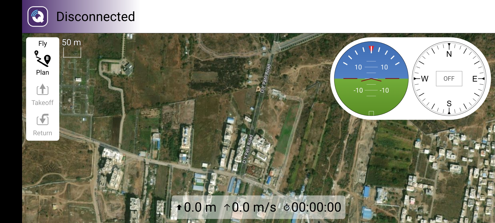
</p>

#### 2. Navigate to Application Settings > Comm Links > Add
<p align="center">
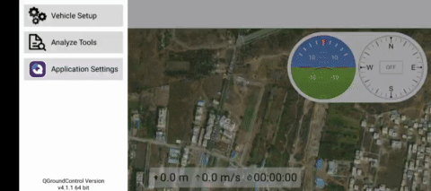
</p>

#### 3. Generate a new UDP Connection
<p align="center">
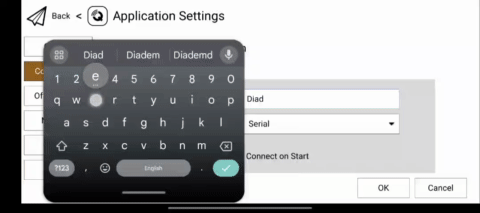
</p>

#### 4. Provide IP Addresses

> [!IMPORTANT]
> Enter the IP address of the robot. [How to obtain IP?](#9-get-ip-address-of-robot)

<p align="center">
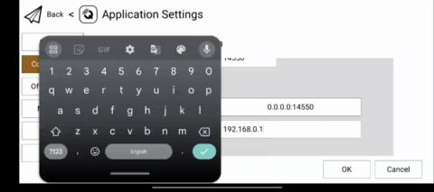
</p>

#### 5. Establish a connection

> [!IMPORTANT]
> There are chances when it is unable to establish a connection the very first time. In that scenario, delete the connection and follow the steps again.

<p align="center">
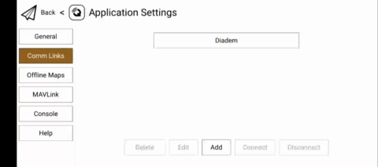
</p>

Once connected, you will be able to see the robot's status and coordinates on the QGC page. Now you can control the vehicle and send missions through QGC.


**Method 2: Using ROS Scripts**


We have provided the API Script along with the package to enable the GPS navigation using ROS scripts

`Navigate to diadem_firmware/scripts/waypoint_navigation.py to get access to the API`

[Link to Documentation](https://github.com/rigbetellabs/diadem/blob/humble-pixhawk-release/diadem_firmware/scripts/readme.md)

> [!IMPORTANT]
> To enable Obstacle avoidance in GPS navigation using Realsense d435i, follow the instructions provided [here](https://ardupilot.org/copter/docs/common-realsense-depth-camera.html)

### 3.6 USB Ports Configuration

> **IMPORTANT**: Connect the USB ports as per the following diagram:

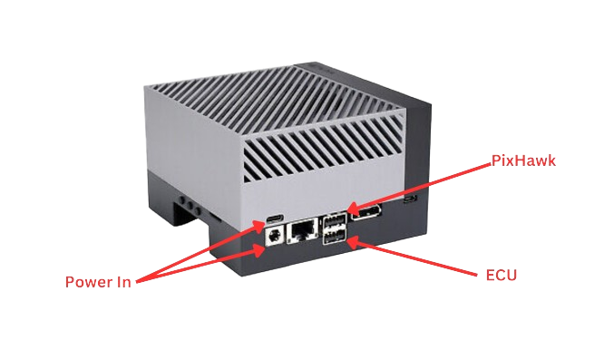
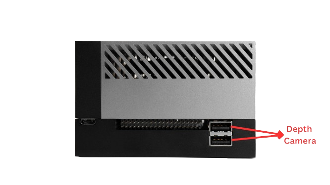

### 3.7 Get IP Address of Robot

To find the IP address of the robot, run the following command on the robot's PC:

```bash
hostname -I
```

This will display the IP address of the robot. Use this IP address to SSH into the robot or connect it to your ROS network.

---

#### Visualizing in remote PC
ROS domain id for robot is set to 169. So to visualize robot ros topics in remote PC we need to enter below command in terminal of remote pc everytime we open a new terminal.

```bash
export ROS_DOMAIN_ID=169
```

## 5. Features via ROS Topics
The list of topics is crucial for low-level control and diagnostic purposes. Here is a comprehensive list:

### Low-Level ROS Topics Subcriber

### `/motor_control/enable`
- **Type:** `std_msgs/Bool`
- **Description:** Enables or disables individual motor control. Ensure this is set to `true` to control the motors individually. 
> [!WARNING]
> Enabling this mode will allow you to control the motors of the robot individually. Make sure you have lifted the robot to a higher level before using this feature to prevent an accidents

### `/motor_control/right_front`
- **Type:** `std_msgs/Int32`
- **Description:** Controls the right front motor of the robot. Make sure `/motor_control/enable` is set to `true` for this to take effect.

### `/motor_control/left_front`
- **Type:** `std_msgs/Int32`
- **Description:** Controls the left front motor of the robot. Make sure `/motor_control/enable` is set to `true` for this to take effect.

### `/motor_control/right_back`
- **Type:** `std_msgs/Int32`
- **Description:** Controls the right back motor of the robot. Make sure `/motor_control/enable` is set to `true` for this to take effect.

### `/motor_control/left_back`
- **Type:** `std_msgs/Int32`
- **Description:** Controls the left back motor of the robot. Make sure `/motor_control/enable` is set to `true` for this to take effect.

To control a motor:
```bash
ros2 topic pub -1 /motor_control/right_front std_msgs/msg/Int32 "{data: 100}" 
```
> [!NOTE]
> The values range from -255 to 255 with 255 being the highest speed in forward direction and -255 being the highest speed in backward direction.


### `/robot/nav_status`
- **Type:** `std_msgs/Int32`
- **Description:** Provides navigation status information of the robot.

### `/robot/network_status`
- **Type:** `std_msgs/String`
- **Description:** Provides network connectivity status of the robot.

### `/pid/mode`
- **Type:** `std_msgs/Int32`
- **Description:** This topic is of type `int` and is used to control the Proportional-Integral-Derivative (PID) controller. 
  - `0` - Stop PID control
  - `1` - Fast PID control
  - `2` - Smooth PID control
  - `3` - Supersmooth PID control

Here's an example:
```bash
ros2 topic pub -1 /pid/control std_msgs/msg/Int32 "{data: 1}" 
```

### `/pid/custom/enable`
- **Type:** `std_msgs/Bool`
- **Description:** Controls the enabling/disabling of custom PID modes.

### `/pid/constants`
- **Type:** `std_msgs/Float32MultiArray`
- **Description:** Updates the PID constants.

### `/pid/custom/save`
- **Type:** `std_msgs/Float32MultiArray`
- **Description:** Saves custom PID configurations.

### `/diagnostics/test`
- **Type:** `std_msgs/Int32`
- **Description:** Runs diagnostics tests on the robot. It serves the purpose of identifying and addressing any issues that may arise during the robot's operation. For detailed diagnostics procedures, refer to the documentation.

### `/cmd_vel`
- **Type:** `geometry_msgs/Twist`
- **Description:** Provides velocity commands in linear and angular dimensions.The `/cmd_vel` topic is responsible for receiving velocity commands for the robot. These commands can be generated by teleoperation or the `move_base` module, instructing the robot on how fast to move in different directions.

### `/ecu/restart`
> [!WARNING]
> Use with caution. The ECU (ESP32) will reset, and pins may enter a floating state.
- **Type:** `std_msgs/Bool`
- **Description:** Handles ECU restart commands.

### `/buzzer/functions/enable`
- **Type:** `std_msgs/Bool`
- **Description:** Controls the enabling/disabling of buzzer functions.

### `/buzzer/battery_low/enable`
- **Type:** `std_msgs/Bool`
- **Description:** Controls the enabling/disabling of battery low warnings through the buzzer.

### `/hill_hold_control`
- **Type:** `std_msgs/Bool`
- **Description:** The /hill_hold_control topic when enabled (It can be enabled by publishing true on /hill_hold_control topic) holds the robot on slope without any user input.

<p align="center">

</p>

### `/microros_domain_id`
- **Type:** `std_msgs/Int32`
- **Description:** The /microros_domain_id enables you to change your firmware's domain id permanently. Once changed, the firmware remembers your last set value and always boots up with the same domain id. (Currently set on domain-id 169)
  
To change the domain id, make sure microros agent is active, Open a new terminal and publish your custom domain id:
```bash
ros2 topic pub -1 /microros_domain_id std_msgs/msg/Int32 "{data: 169}" 
```
The robot will change the domain ID and reset the ECU automatically to make the necessary changes. You will able to see the topics on your custom domain id now.

### Low-Level ROS Topics Publisher

#### `/battery/percentage`
This topic provides information about the remaining battery percentage of the robot. 

| Battery Percentage  | Beeping Sounds              |
|----------------------|-----------------------------|
| 100 - 20            | No beeping                  |
| 20 - 15              | Beep every 2 minutes        |
| 15 - 10              | Beep every 1 minute        |
| Below 10             | Very frequent beeping      |
| 0 (Complete Discharge)| Continuous beep             |

> [!TIP]
> To ensure you are aware of the robot's battery status, pay attention to the beeping sounds, especially as the battery percentage decreases.

> [!CAUTION]
> Do not drain the battery below `10 %`, doing so can damage the battery permanently.

#### `/battery/voltage`
This topic reports the current battery voltage, ranging from 29.4V at maximum charge to 22.4V at minimum charge.

#### `/wheel/ticks`
This topic provides an array of ticks for all four wheels of the robot, in the format `[lf, lb, rf, rb]`. These values represent the encoder readings of the wheel ticks.

#### `/wheel/vel`
The `/wheel/vel` topic sends an array of calculated current velocities for each wheel on the robot, received via encoders. The format of the array is `[lf, lb, rf, rb]`, representing the actual velocity at which each wheel is moving.

### `/wheel/rpm`
- **Type:** `std_msgs/Int32MultiArray`
- **Description:** Provides the RPM (Revolutions Per Minute) of the wheels in the format `[lf, lb, rf, rb]`.

### `/cmd_vel`
- **Type:** `geometry_msgs/Twist`
- **Description:** Publishes the robot's velocity commands.

### `/imu/data`
- **Type:** `sensor_msgs/Imu`
- **Description:** Provides IMU (Inertial Measurement Unit) data including orientation, angular velocity, and linear acceleration.

### `estop/status`
- **Type:** `std_msgs/Bool`
- **Description:** Publishes the status of the Emergency Stop button.

### `pixhawk/control`
- **Type:** `std_msgs/Bool`
- **Description:**  Publishes feedback on the Pixhawk control status.


## 6. Diadem Robot Parameters

The parameters for the robot can be dynamically reconfigured via rqt_reconfigure. Here are some key parameters:

| Parameter                   | Value                                     |
|-----------------------------|-------------------------------------------|
| **Drive Type**             | Skid Steer Drive                             |
| **Diameter**                | 0.35m                                      |
| **Wheel Separation Width**  | 0.58m                                    |
| **Wheel Separation Length** | 0.5 m                                    |
| **Motor Type**              | DC Geared Motor                 |
| **RPM**                     | 110                                       |
| **Encoder Type**            | Magnetic Encoder                          |
| **PPR (Pulses Per Revolution)**| 600                                      |
| **Microcontroller**         | DOIT-ESP32 Devkit V1                      |
| **Robot Payload Capacity**  | 200-250 kgs                                   |
| **Battery Life**            | About 3 hours                             |
| **Battery Type**            | Lithium-ion 193AH 6S 24V                |

## 7. Diagnostic Tests

### Overview

The diagnostic tests are a set of procedures to ensure the proper functionality of the robot. They can be run using ROS tools.

### Instructions

1. Make sure the robot is connected to the WiFi network.
2. SSH into the robot's PC.
3. Run the diagnostic scripts provided.

### Detailed Instructions

Here is how you can perform a detailed diagnostic:

```bash
cd ~/ros2_ws/src/diadem/diadem_firmware/scripts
python3 diadem_diagnostics.py
```

### How to Run Diagnostics

The diagnostics.py script will perform several checks:

- Check IMU data consistency.
- Check battery status.
- Check motor functionality.
- Verify topic publishing rates.

### Important Notes
- It is crucial to execute the tests with caution and follow the on-screen instructions for each test to ensure accurate results.
- Ensure that the robot has sufficient space to move during the motor direction test (Test Number: 2).
- If any issues are identified during the tests, refer to the specific diagnostic output for guidance on addressing the problem.
- Ensure the robot is on a flat surface before running IMU diagnostics.
- Monitor the battery status to prevent running diagnostics on a low battery.
- If any tests fail, refer to the error logs for more information.

By following these instructions, you can perform diagnostic tests on the diadem robot to identify and resolve any issues with its components.

## 8. Charging Instructions

<div align="center">

### Charger Provided with the robot
</div>
<p align="center">
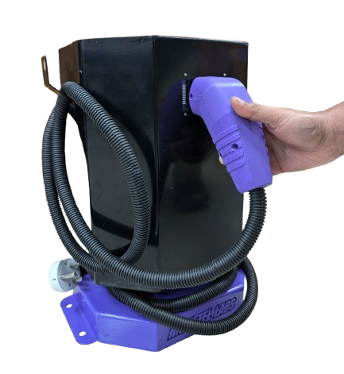
</p>

**Step 1**: Set your robot into charging mode before plugging in the charger
<p align="center">

</p>

> [!NOTE]
> The charger demands an input supply of upto 220V 16A AC. Make sure the power socket supports for the same.

**Step 2**: Plugin the charger

<p align="center">
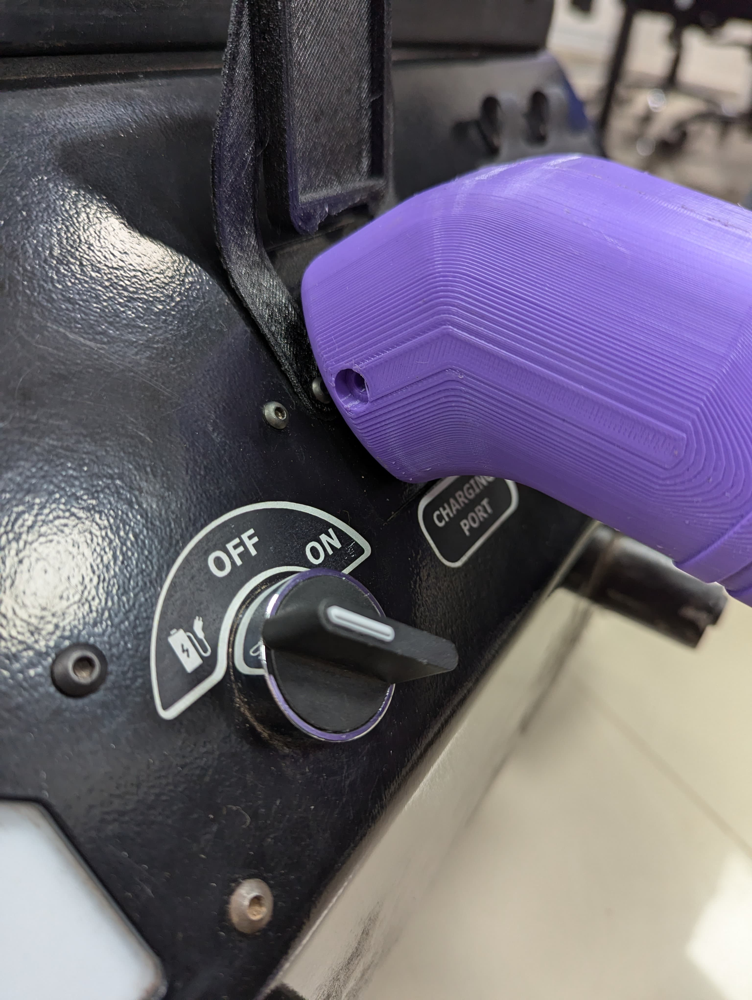
</p>

## 9. Removing the top lid of the robot
> [!WARNING]
> **Precautions when opening the top panel of robot**:
Remove the thumb screws and slightly open up the top lid of the robot. Remove the realsense and gps cables before completely lifting the lid of the robot.


| 1. Camera Cable           | 2. GPS Cable                               | 
|--------------------|---------------------------------------------|
|    |    |


## 10. LED indicators instructions

### Nomenclature
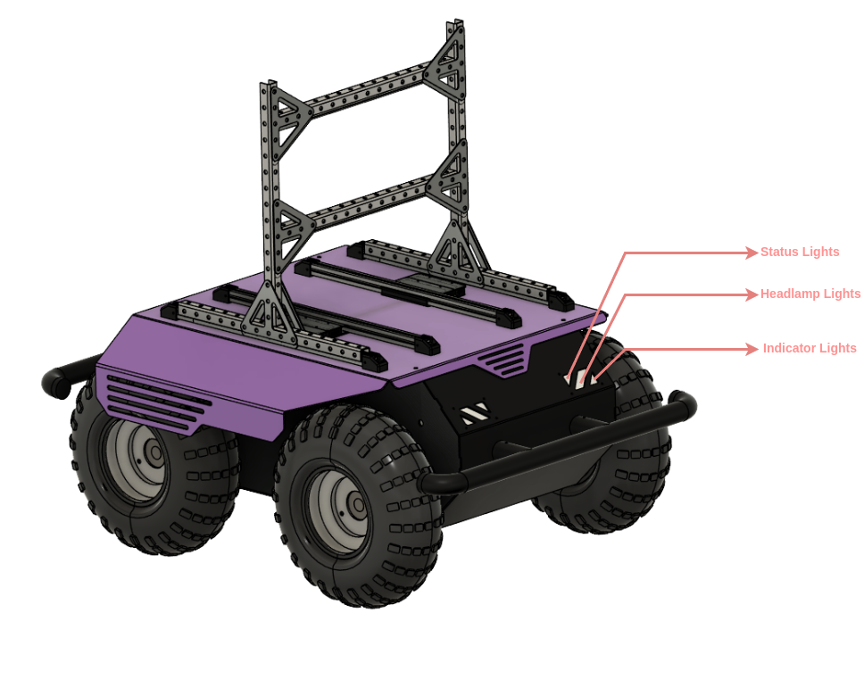


------

### Instructions
1. 
<p align="center">
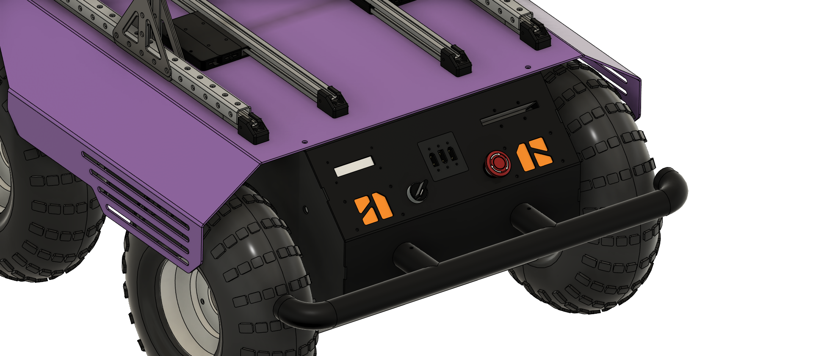

| Indication type             | Indicates            |
|-----------------------------|----------------------|
| All orange fading effect    | ROS/RC not connected    |

</p>

------
<div style="page-break-after: always;"></div>

2. 
<p align="center">


| Indication type             | Indicates            |
|-----------------------------|----------------------|
| White Statuslights, White Headlights, Red Brakelights | ROS Mode Connected     |

</p>

------

3. 
<p align="center">


| Indication type             | Indicates            |
|-----------------------------|----------------------|
| Blue Statuslights, White Headlights, Red Brakelights | Pixhawk Control over ROS     |

</p>

------
4. 
<p align="center">


| Indication type             | Indicates            |
|-----------------------------|----------------------|
| Purple Statuslights, White Headlights, Red Brakelights | ROS Mode Connected     |

</p>

------
5. 
<p align="center">


| Indication type             | Indicates            |
|-----------------------------|----------------------|
| Orange Indicatorlights, Red Brakelights | ForwardLeft Movement    |

</p>

------
6. 
<p align="center">


| Indication type             | Indicates            |
|-----------------------------|----------------------|
| Orange Indicatorlights, Red Brakelights | ForwardRight Movement    |

</p>

------
7. 
<p align="center">


| Indication type             | Indicates            |
|-----------------------------|----------------------|
| Orange Indicatorlights, Red Brakelights | RotateinPlace Movement    |

</p>

------
8. 
<p align="center">


| Indication type             | Indicates            |
|-----------------------------|----------------------|
| Yellow Indicatorlights, Red Brakelights | ForwardLeft Movement    |

</p>

------
9. 
<p align="center">
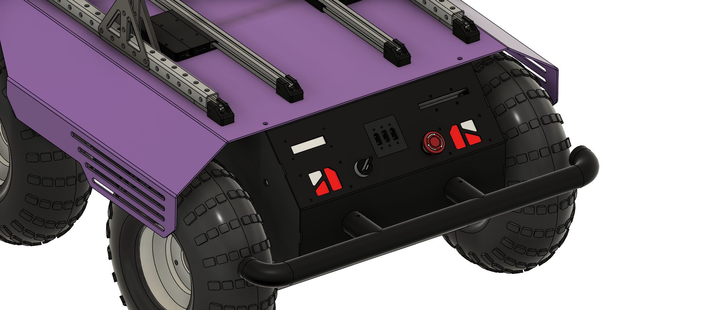

| Indication type             | Indicates            |
|-----------------------------|----------------------|
| Red Indicatorlights, Red Brakelights | Battery Low indication   |

</p>

------
10. 
<p align="center">
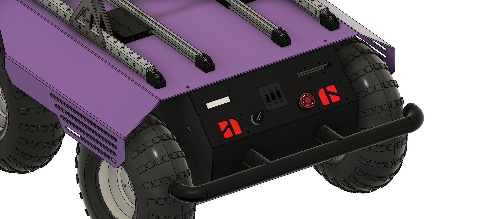

| Indication type             | Indicates            |
|-----------------------------|----------------------|
| All lights red | Emergency button pressed   |

</p>